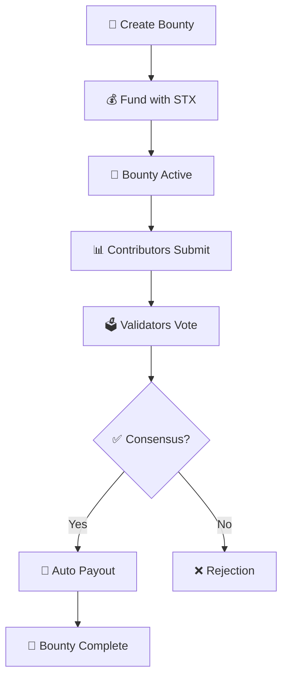

> 🎯 A decentralized platform for AI researchers to request, fund, and validate datasets through smart contracts

## 🌟 Overview

The AI Dataset Bounty Board solves the critical problem of AI researchers struggling to find clean, diverse datasets for training models. Our platform enables users to propose and fund dataset collection tasks with automatic payouts via smart contracts.

## ✨ Key Features

- 💰 **Dataset Bounty Creation** - Propose dataset requirements with STX rewards
- 📊 **Dataset Submission** - Contributors submit IPFS-hosted datasets
- 🏛️ **Community Validation DAO** - Validator network for quality assurance
- ⚡ **Automatic Payouts** - Smart contract handles reward distribution
- 🔒 **IPFS Integration** - Decentralized storage with on-chain hash verification

## 🚀 Quick Start

### Prerequisites

- [Clarinet](https://github.com/hirosystems/clarinet) installed
- Stacks wallet for testing

### Installation

```bash
git clone <repository-url>
cd Smart-Contract-Based-AI-Dataset-Bounty-Board
clarinet check
```

### Development

```bash
# Start development console
clarinet console

# Run tests
clarinet test

# Deploy to testnet
clarinet deploy --testnet
```

## 📋 Usage Guide

### 1. 🎯 Creating a Dataset Bounty

```clarity
(contract-call? .Smart-Contract-Based-AI-Dataset-Bounty-Board create-bounty
  "Image Classification Dataset"
  "Need 10,000 labeled images of cats and dogs for computer vision training"
  u10000
  u2000  ;; deadline (block height)
  u1000000)  ;; reward in microSTX
```

### 2. 📤 Submitting a Dataset

```clarity
(contract-call? .Smart-Contract-Based-AI-Dataset-Bounty-Board submit-dataset
  u1  ;; bounty-id
  "QmYourIPFSHashHere123456789"
  u12000)  ;; sample count
```

### 3. 🗳️ Validator Registration

```clarity
(contract-call? .Smart-Contract-Based-AI-Dataset-Bounty-Board register-validator)
```

### 4. ✅ Voting on Submissions

```clarity
(contract-call? .Smart-Contract-Based-AI-Dataset-Bounty-Board vote-on-submission
  u1  ;; submission-id
  true)  ;; approve (true) or reject (false)
```

### 5. 🏁 Finalizing Results

```clarity
(contract-call? .Smart-Contract-Based-AI-Dataset-Bounty-Board finalize-submission u1)
```

## 🔍 Contract Functions

### Public Functions

| Function | Description | Parameters |
|----------|-------------|------------|
| `create-bounty` | 📝 Create new dataset bounty | title, description, required-samples, deadline, reward |
| `submit-dataset` | 📊 Submit dataset for bounty | bounty-id, ipfs-hash, sample-count |
| `register-validator` | 👥 Register as community validator | none |
| `vote-on-submission` | 🗳️ Vote on dataset quality | submission-id, vote |
| `finalize-submission` | ✅ Complete validation process | submission-id |
| `cancel-bounty` | ❌ Cancel active bounty | bounty-id |

### Read-Only Functions

| Function | Description |
|----------|-------------|
| `get-bounty` | 📖 Get bounty details |
| `get-submission` | 📄 Get submission details |
| `get-submission-votes` | 📊 Get voting results |
| `get-validator` | 👤 Get validator information |
| `get-contract-balance` | 💰 Get contract STX balance |

## 🔄 Workflow



## 🏗️ Data Structures

### Bounty
- `creator` - Bounty creator's principal
- `title` - Dataset title (128 chars)
- `description` - Detailed requirements (512 chars)
- `reward` - STX reward amount
- `deadline` - Submission deadline
- `required-samples` - Minimum dataset size
- `status` - Current bounty state

### Submission
- `bounty-id` - Associated bounty
- `contributor` - Submitter's principal
- `ipfs-hash` - Dataset IPFS hash
- `sample-count` - Submitted sample count
- `status` - Validation status
- `validation-end` - Voting deadline

## 🔐 Security Features

- ✅ Fund escrow in smart contract
- ✅ Time-based validation periods
- ✅ Multi-validator consensus
- ✅ Creator-only bounty cancellation
- ✅ Reputation-based validation

## 📊 Error Codes

| Code | Description |
|------|-------------|
| `u100` | Owner only operation |
| `u101` | Resource not found |
| `u102` | Unauthorized access |
| `u103` | Invalid bounty parameters |
| `u104` | Insufficient funds |
| `u105` | Already submitted |
| `u106` | Invalid vote |
| `u107` | Bounty expired |
| `u108` | Bounty not active |

## 🧪 Testing

Run the test suite to verify contract functionality:

```bash
clarinet test
```

## 🤝 Contributing

1. Fork the repository
2. Create your feature branch (`git checkout -b feature/amazing-feature`)
3. Commit your changes (`git commit -m 'Add amazing feature'`)
4. Push to the branch (`git push origin feature/amazing-feature`)
5. Open a Pull Request

## 📄 License

This project is licensed under the MIT License - see the LICENSE file for details.

## 🌐 Links

- [Stacks Documentation](https://docs.stacks.co/)
- [Clarity Language Reference](https://docs.stacks.co/clarity/)
- [IPFS Documentation](https://docs.ipfs.io/)

---

Built with ❤️ for the AI research community
